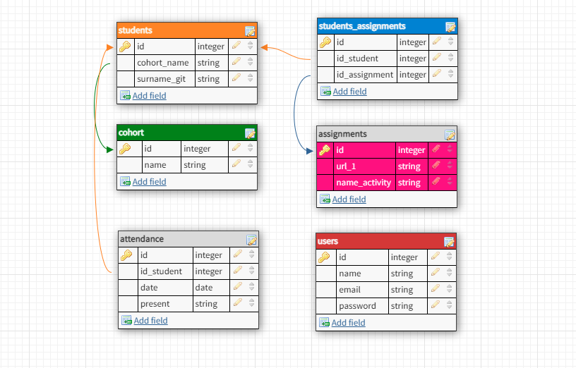

# Table of Contents

- [Architecture](#Architeture)
  - [Backend](#Backend)
  - [DB design](#DB-design)
  - [Frontend](#Frontend)
  - App flow
- [Setup](#Setup)
- [Getting started](#Getting-started)
  - [Install libraries and depedencies](#Install-libraries-and-depedencies)

# Architeture

## Backend

- `routes` contains all routes using express for https requests GET, PUT, DELETE and POST.

- `config`, contains config file, with the secret key and bcript for the authentication.

- `model`, contains all table models for the project, including: _students, cohorts, attendance, assignments, student_assignments and users_. All these models are located in a sql script called init_db.sql which can be runned using the command: `yarn run migrate`

  - `seed.sql`, contains all seed files and it's another script with data examples to populate the DB. Can be runned using the command: `yarn run seed`

## DB design



## Frontend

- `components` [to complete]

- `helpers` [to complete]

- `views` [to complete]

# Setup

## Getting started

**Make sure** you create a database in MySQL that we will be using in this project. Steps to create a databse using MySQL:

1.  Open your terminal and type the command:
    `mysql -u root -p`
2.  Type your password and hit `enter`
3.  Type the SQL command: `CREATE database codeop;`

Add your `.env` file inside the root of this project with the following data:

```
DB_HOST=localhost
DB_USER=root
DB_PASS=root
DB_NAME=codeop
```

### Install libraries and depedencies

- In the root of your app:
  - `yarn && yarn start`
  - `yarn run migrate`
  - `yarn run seed`
- Inside client:
  - `yarn && yarn start`
